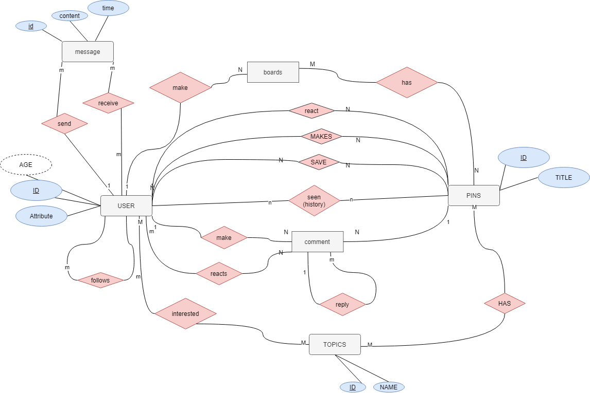

# Pinterest
pinterest
https://app.diagrams.net/#Hkataya1%2FPinterest%2FERD%2Ferd2

## Requirements

- A typical profile for a user  + (bio, website-link 
- A user has pins it’s like saved posts 
- A user may have one or more board/s
- the user has a topic list. it's categories of the topics he's interested in  
  - The topic list is what use to display the posts in home for the user
  - The topic list if updated based on the user pins 
- The user has followers and following 
- website has 2 pages home and today
  - home is where the user sees posts from other people 
    - Home could be sorted by relevance
  - Today has a list of all the trending hashtags that day
    - Hashtags is an umbrella that has all related topics under it
---
### ERD

